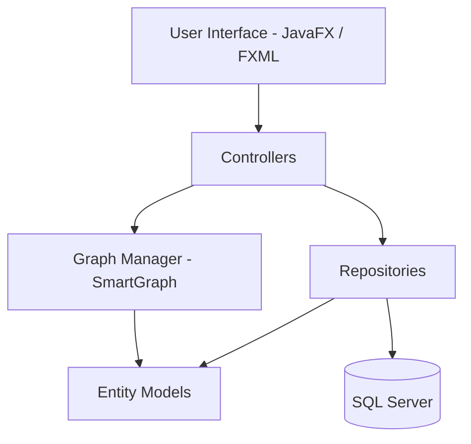

  

<h1 align="center">ReConan</h1>

  
  
  
  

ReConan is a **Desktop-based OSINT and cyber investigation platform**. It aggregates intelligence from multiple public data sources, storing and visualizing relationships between digital entities (such as domains, IPs, emails, and usernames).

> **Fun Fact:** The name *ReConan* is just a highly sophisticated portmanteau of **Reconnaissance** and **Conan the Detective**. Because who better to investigate cyber threats than a brilliant, permanently-young anime detective?

## Use Case
ReConan is designed for **digital reconnaissance and relationship analysis**. Investigators can use the platform to seamlessly connect the dots between various online identities and infrastructure elements. It serves as an interactive environment to discover, store, and explore entity relationships through a dynamic investigation graph.

## Technologies Used
- **Language**: Java
- **User Interface**: JavaFX
- **Graph Visualization**: JavaFX SmartGraph
- **Database**: SQL Server
- **Data Access**: JDBC
- **Build Tool**: Maven

## Architecture
ReConan follows a clean, **layered architecture** designed for modularity and maintainability:

### 🏛️ Layered Structure
1. **User Interface (JavaFX)**:
   - Uses **FXML** for layout and **CSS** for professional styling.
   - **ViewLoader** manages scene transitions and FXML loading.
2. **Controller Layer**:
   - Manages UI events and coordinates between the Graph Manager and Data Repositories.
   - Implements complex session-to-database persistence logic (ID mapping).
3. **Graph Management**:
   - Built on **JavaFX SmartGraph**, providing a dynamic, force-directed graph environment.
   - **GraphManager** encapsulates graph logic, custom styling, and layout physics.
4. **Data Access Layer (Repositories)**:
   - Uses the **Repository Pattern** with JDBC for database interactions.
   - Handles CRUD operations for investigations, entities, and relationships.
5. **Entity Models**:
   - Plain Java Objects (POJOs) representing the core domain: `Investigation`, `Entity`, and `Relationship`.
6. **Persistence Layer**:
   - **SQL Server** database with a relational schema optimized for entity-relationship mapping.
   - **DatabaseManager** handles automated schema initialization and connectivity.

## Contributing
We welcome contributions! Please see our [Contributing Guidelines](CONTRIBUTING.md) for details on how to fork the repository, set up your `.env` file, compile the project using `mvn javafx:run`, and submit Pull Requests.

## Contributors
Thanks to these wonderful people for contributing to ReConan!

